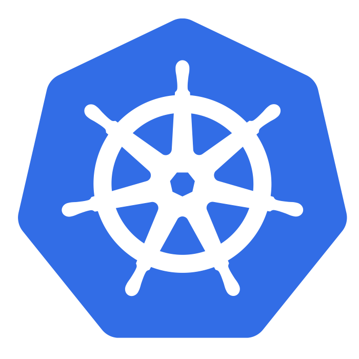

include::includes/_settings.adoc[]

:revealjs_theme: sobkowiak-cg
:speaker: Krzysztof Sobkowiak (http://twitter.com/ksobkowiak[@ksobkowiak])
:speaker-title: The Apache Software Foundation Member, Senior Solution Architect at Capgemini
:speaker-email: krzysztof.sobkowiak@capgemini.com
:speaker-blog: http://krzysztof-sobkowiak.net
:speaker-twitter: http://twitter.com/ksobkowiak[@ksobkowiak]

//= Services Orchestration on OpenShift using Spring Cloud Kubernetes
= Orchestrate Your Services on OpenShift using Spring Cloud Kubernetes

//image::title-logo.png[align="center", width="30%"]

[.noredheader,cols="35%,30%,35%"]
|===
>.^| image:images/spring-cloud-netflix-logo.png[align="center", width="27%"]
^.<| 
<.^| image:images/openshift-logo.png[align="center", width="25%"]
|
|===

[.cover]
--

[.event]
Capgemini Open Days +
Wrocław, Poznan, June 2017

[.newline]
{speaker}
[.speaker-title]
The Apache Software Foundation Member +
Senior Solution Architect at Capgemini
//[.logo-left]
//image:{template-images-dir}/feather.png[width="60", link="http://apache.org"]
--

== !

[.centering]
--

* link:wroclaw.html[Capgemini Open Days, Wrocław, 6th of June 2017]
* link:poznan.html[Capgemini Open Day, Poznan, 13th of June 2017]

--
